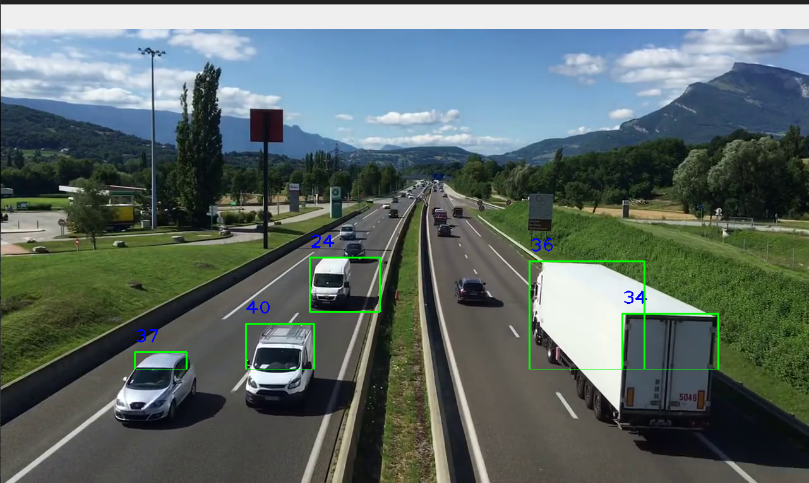

# car-speed-tracking

Simple application of how to use the "OpenCV" python module to track a object in real time from a video source.

### dependencies

- opencv-python
- numpy

### References:
  1. https://www.youtube.com/watch?v=O3b8lVF93jU&ab_channel=Pysource
  2. https://github.com/prem-kumar-reddy/vehicle-classification-counting/blob/main/tracker.py